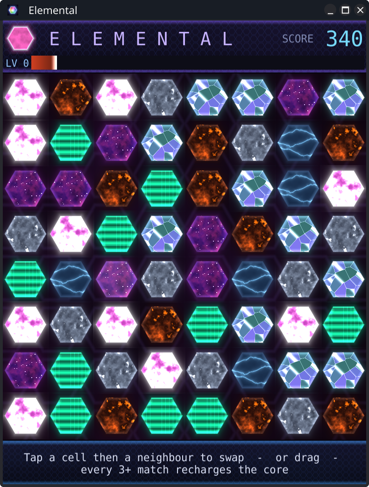

# Elemental

A match-three game where every piece is a glowing **energy cell** rendered
entirely by a procedural GLSL fragment shader — no sprite art at all. The shader
*is* the sprite. Elemental is a showcase for Fyne's [`canvas.Shader`](https://pkg.go.dev/fyne.io/fyne/v2/canvas#Shader)
object type and the power of OpenGL inside a [Fyne](https://fyne.io) app.



## The elements

Seven materials, each generated in GLSL and identified by its motion and palette
rather than any label — you learn to read them:

- **Plasma** — swirling hot-pink energy
- **Arc** — electric cyan lightning
- **Metal** — rippling liquid chrome
- **Lava** — molten crust and glow
- **Crystal** — drifting, glimmering facets
- **Nebula** — deep violet star clouds
- **Hologram** — green scanlines and glitch

The dark background is itself a reactive shader: a slow nebula, a faint hex
lattice, and a shock wave that radiates from every match.

## How to play

- **Tap** a cell, then a neighbour to swap them — or **drag** between two cells.
- Line up **3 or more** of the same element to clear them.
- Cascades, **L / T / X** crosses and **5-in-a-row** lines trigger bigger
  explosions and bigger rewards.

### Jeopardy: keep the core lit

A **core-energy** gauge drains continuously. Every match recharges it — more
cells, deeper combo cascades and compound-match explosions all charge it harder.
Let the core hit zero and it goes dark: **game over**.

Difficulty climbs with your score (`level = score / 800`), and each level speeds
up the drain — so the better you play, the harder the core is to keep alive.

## Building and running

Requires [Go](https://go.dev) and the [Fyne prerequisites](https://docs.fyne.io/started/)
(a C compiler and OpenGL development headers).

```sh
go run .
```

To produce a packaged, distributable build:

```sh
go install fyne.io/tools/cmd/fyne@latest
fyne package
```

